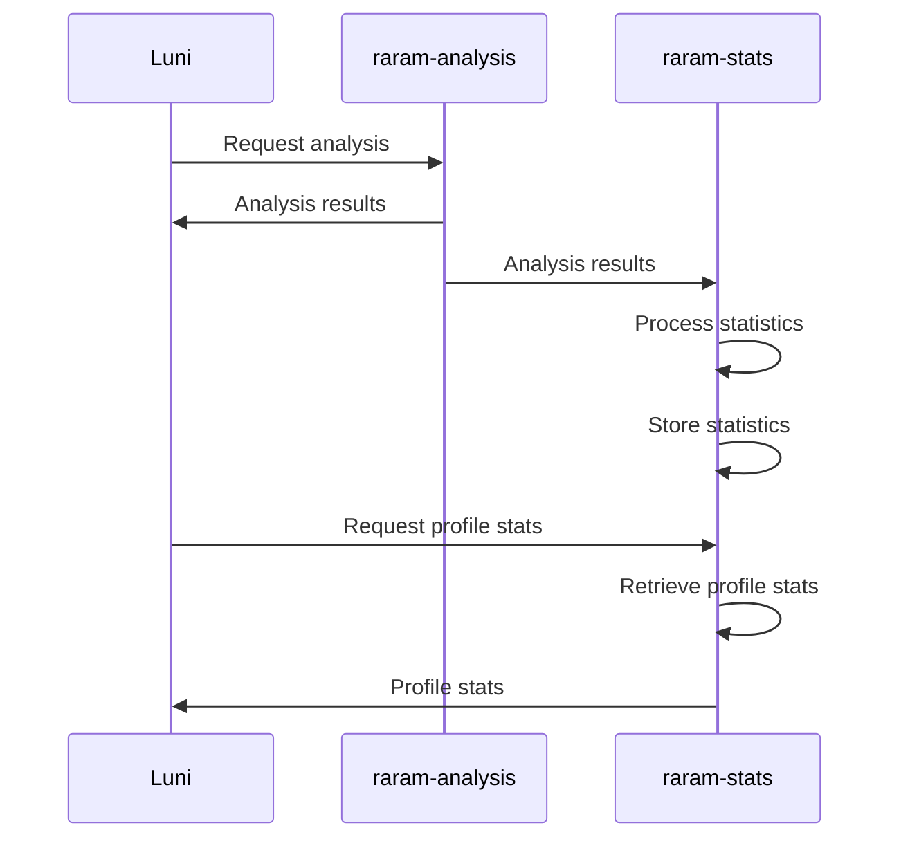

# Luniverse

Welcome to Luniverse, a collection of projects inspired by the League of Legends universe. Our first project is rARAM, a Discord bot that helps you track your performance in ARAM games. With rARAM, you can see how well you played and compare your Poro Points with your friends. It also keeps track of champion-specific stats! In the future, we'll be adding a leaderboard feature.

Our next project is lol-quotes, a mini game where players have to guess which champion said a certain quote. Stay tuned for more updates on these and other exciting projects in the Luniverse!

# Why

Luniverse's rARAM is a complete rewrite of the previous version, rARAM v2. While rARAM v2 was a monolithic application, Luniverse's rARAM is being built using a microservice architecture. This means that the different aspects of the application are split into smaller, independent services that communicate with each other through APIs. The different microservices will be explained later on.

One of the main goals of this project is for me to learn about microservices and how they can be used to build scalable and modular applications. I'm also looking to learn about communication using the MQTT protocol. In this project, I will be using RabbitMQ for this, but I have been recommended to give Redis Streams a try, which I might do in the future.

In addition to the technical learning opportunities, I'm also looking to improve the coding practices used in the Discord bot aspect of the application. This will involve refactoring the codebase to follow established best practices and adding new features and functionality to the bot. However, working on the Discord bot is not my priority, and keeping the API as perfect as possible would be a waste of time. A personal project such as this one should not strive to be perfect.

Overall, Luniverse's rARAM is a great **learning** project that allows me to **explore** new technologies and **improve** my coding skills **in a fun and engaging way**.

# Architecture

In Luniverse's rARAM, players can use the Discord bot called Luni to request an analysis of their last ARAM game. When this happens, the raram-analysis microservice is called to perform the analysis. The results are then sent via a message queue to the raram-stats microservice, which processes the statistics and stores them in its own database.

To authenticate these requests, the auth microservice is used. It has its own database to store user information.

