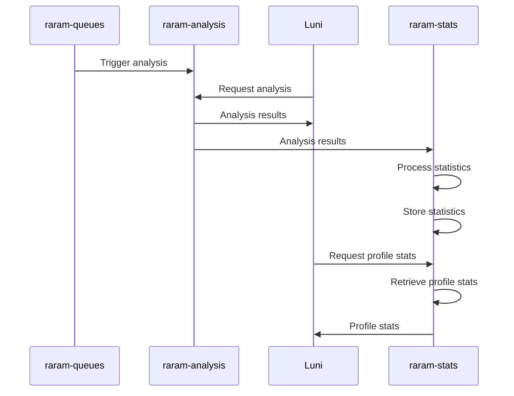

# Luniverse

Welcome to Luniverse, a collection of projects inspired by the League of Legends universe. Our first project is rARAM, a small dashboard that helps you track your performance in ARAM games. With rARAM, you can see how well you played and compare your Poro Points with your friends. It also keeps track of champion-specific stats! In the future, we'll possibly be adding a leaderboard feature, the ability to add friends and form a guild and a shop where you can spend your hard earned Poro Snax!

The second project, done in early january 2023 is called Poro Snowdown, a mini game where players have to guess which champion said a certain quote. More info below!

# Why

Luniverse's rARAM is a complete rewrite of the previous version, rARAM v2. While rARAM v2 was a monolithic application, Luniverse's rARAM is being built using a microservice architecture. This means that the different aspects of the application are split into smaller, independent services that communicate with each other through APIs. The different microservices will be explained later on.

# History

While rARAM v1 and v2 were built on a polyrepo structure wherein the Discord bot and the Backend were distincly separated, rARAM v3 is approaching it differently with this mono-repo. rARAM's backend has seen quite an evolution; it all started when I had zero backend experience with a simple ExpressJS API. Then, I decided to learn NestJS, which very quickly became my 'coup de coeur'. rARAM v3 pushes my passion for NestJS even further, utilizing its microservice approach as a learning project.

One of the main goals of this project is for me to learn about microservices and how they can be used to build scalable and modular applications. I'm also looking to learn about communication using the MQTT protocol. In this project, I will be using RabbitMQ for this, but I have been recommended to give Redis Streams a try, which I might do in the future.

In addition to the technical learning opportunities, I'm also looking to improve the coding practices, without sacrificing too much time on perfection. This involves refactoring the previous codebase in order to follow best practices, improving existing code and adding new features and functionality. It is important for me to remember that a personal project such as this one should not strive to be perfect; this is something very valuable that I have learned in the past year.

Overall, Luniverse's rARAM is a great **learning** project that allows me to **explore** new technologies and **improve** my coding skills **in a fun and engaging way**. Hopefully you'll like it too!

# What's next?

As of 14/01/23, I have decided to pause the development of rARAM for a totally different project. It has been super interesting and I'm hoping to come back to this one day. Here are the tasks that I still wanted to do:

### Deployment

I'd like to finish the K8S deployment of the microservices. Good progress has already been made using Helm in the auth microservice. The main problem I've encountered is the deployment of the MongoDB instance. I wanted to deploy the microservices on Linode.

### Logging and Monitoring

I was experimenting with Betterstack's Logtail. A branch can be found on the repository with the minimalistic setup that is required in each microservice. It all comes down to a LoggerModule shared in `@luni/common`. Using Prometheus metrics in a Grafana instance was planned but I didn't have the time to do it.

### Realtime

It might be interesting to send Realtime messages (with Ably for example) in order to let the frontend know when a game has been analyzed.

### Frontend

The frontend could implement more pages including leaderboards and a register/login system.
The React apps have yet to be Dockerized.

# Architecture

In Luniverse's rARAM, players can use the React dashboard to display their stats and recent analyzed matches. The raram-queues microservice constantly searches for Luni players' ARAM games and the raram-analysis microservice is then called to perform said analysis. The results are then sent via a message queue to the raram-stats microservice, which processes the statistics and stores them in its own database.

To authenticate these requests, the auth microservice is used. It has its own database to store user information.

# Snowdown

Snowdown is a monolithic API built with NestJS and a MongoDB database. It contains player guesses, champion quotes, and game sessions. The frontend of the application is built with React Native and Expo, which allowed for quick learning of mobile development.

A simple scraper was built with Puppeteer to gather URLs for champion quotes. The scraper gathered a total of 17000 quotes, making for a fun guessing experience!

## Game Modes

Snowdown has two modes: "hard" and "infinite". In "hard" mode, the game stops as soon as an incorrect guess is made. In "infinite" mode, the game continues with new quotes each time and displays the correct answer, regardless of whether the player correctly guesses the champion. Both modes have a "streak" feature that displays how many quotes have been correctly guessed without failure.

The development of Snowdown was greatly informed by "guess-quote", an earlier version of the application that I worked on in the past. Lessons learned include not saving each quote as a file in the MongoDB (which brings a lot of complexity), using URLs to access quotes (super easy, enough for such a small project), and using champion IDs instead of champion names.

## Demo

https://user-images.githubusercontent.com/56871713/213805118-ce49df9f-70aa-4a2d-9dda-078386d2550e.mp4
